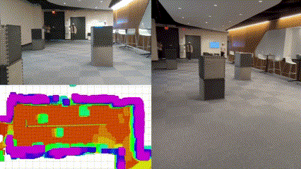

# Intent Prediction-Driven Model Predictive Control for UAV Planning and Navigation in Dynamic Environments
[](https://wiki.ros.org/noetic)
[](https://releases.ubuntu.com/20.04/)
[](https://opensource.org/licenses/MIT) 
[](https://releases.ubuntu.com/20.04/)
[](https://releases.ubuntu.com/20.04/)


This repository implements the Intent Prediction-Driven Model Predictive Control (Intent-MPC) framework, enabling the robot to navigate safely in dynamic environments.

<table>
  <tr>
    <td></td>
    <td></td>
    <td></td>
  </tr>
</table>


For additional details, please refer to the related paper available here:

Zhefan Xu*, Hanyu Jin*, Xinming Han, Haoyu Shen, and Kenji Shimada, "Intent Prediction-Driven Model Predictive Control for UAV Planning and Navigation in Dynamic Environments”, *IEEE Robotics and Automation Letters (RA-L)*, 2025. [\[IEEE Xplore\]](https://ieeexplore.ieee.org/document/10945375) [\[preprint\]](https://arxiv.org/pdf/2409.15633) [\[YouTube\]](https://youtu.be/4xsEeMB9WPY) [\[BiliBili\]](https://www.bilibili.com/video/BV1e9XhYQEqA/)

*The authors contributed equally.

## News
- **2025-03-25:** The GitHub code, video demos, and relavant papers for our Intent-MPC Navigation framework are released. The authors will actively maintain and update this repo!


## Table of Contents
- [Installation Guide](#I-Installation-Guide)
- [Run a Quick Demo](#II-Run-a-Quick-Demo)
- [Citation and Reference](#III-Citation-and-Reference)
- [Acknowledgement](#IV-Acknowledgement)

## I. Installation Guide
The system requirements for this repository are as follows. Please ensure your system meets these requirements:
- Ubuntu 18.04/20.04 LTS
- ROS Melodic/Noetic

Please follow the instructions below to install this package.
```
# step1: install dependencies
sudo apt install ros-${ROS_DISTRO}-octomap* && sudo apt install ros-${ROS_DISTRO}-mavros* && sudo apt install ros-${ROS_DISTRO}-vision-msgs

# step 2: clone this repo to your workspace
cd ~/catkin_ws/src
git clone https://github.com/Zhefan-Xu/Intent-MPC.git

# step 3: follow the standard catkin_make procedure
cd ~/catkin_ws
catkin_make

# step 4: add environment variables to your ~/.bashrc
echo 'source path/to/uav_simulator/gazeboSetup.bash' >> ~/.bashrc
```


## II. Run a Quick Demo
Once the package is properly installed, you can run the following command to launch a quick demo of UAV navigation in a dynamic environment.
```
# start the uav simulator
roslaunch uav_simulator start.launch

# launch the intent MPC navigation 
roslaunch autonomous_flight intent_mpc_demo.launch
```
The simulation environment will load in a Gazebo window, while an RViz window visualizes the robot’s sensor data and planned trajectories. The robot will follow a circular path while avoiding both static and dynamic obstacles.


https://github.com/user-attachments/assets/2ed3163f-c4e3-43d3-9ac5-11ac57a344d3


## III. Citation and Reference
If our work is useful to your research, please consider citing our paper.
```
@ARTICLE{Intent-MPC,
  author={Xu, Zhefan and Jin, Hanyu and Han, Xinming and Shen, Haoyu and Shimada, Kenji},
  journal={IEEE Robotics and Automation Letters}, 
  title={Intent Prediction-Driven Model Predictive Control for UAV Planning and Navigation in Dynamic Environments}, 
  year={2025},
  volume={10},
  number={5},
  pages={4946-4953},
  keywords={Trajectory;Vehicle dynamics;Navigation;Planning;Dynamics;Collision avoidance;Autonomous aerial vehicles;Predictive control;Detectors;Heuristic algorithms;Aerial systems: Perception and autonomy;integrated planning and control;RGB-D perception},
  doi={10.1109/LRA.2025.3555937}}
```

## IV. Acknowledgement
This paper is based on results obtained from a project of Programs for Bridging the gap between R\&D and the IDeal society (society 5.0) and Generating Economic and social value (BRIDGE)/Practical Global Research in the AI×Robotics Services, implemented by the Cabinet Office, Government of Japan.

The authors would like to express their sincere gratitude to Professor Kenji Shimada for his great support and all CERLAB UAV team members who contribute to the development of this research.
